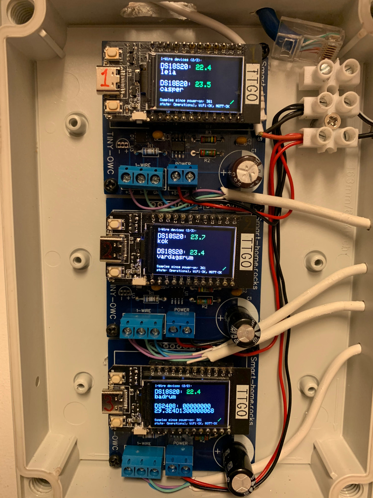
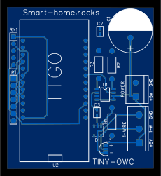

# TINY-OWC

## Introduction

This is a device that is primarily intended to be used as a controller for a floor heating system in your home, however it's quite versatile so you could use it for other applications too. The device consists of a [TTGO T-display ESP32 microcontroller](https://www.google.se/search?q=ttgo+t-display+esp32&tbm=isch) and some circuits for communicating with Maxim/Analog Devices 1-Wire devices.

<p>Three stacked TINY-OWC controllers:</p>

<p>DS2408-based relay board controlling the heating:</p>


Tiny-OWC (Tiny OneWire Controller) samples all temperature sensors available on the 1-Wire buss every 15 seconds, if the temperature is outside a predeterminant range the Tiny-OWC will signal a actuator that will turn on/off the heat in that room.

Currently supported temperature sensors are: DS18S20, DS18B20, DS1822

Currently supported actuators are: DS2408 (possible future support for DS2405, DS2406, DS2413)

Other sensors supported: DS2423 (dual 32-bit counter)

Current settings and status is displayed on the TTGO LCD-display for easy overview. Status and settings are also available over the MQTT-protocol using the build in WiFi, for easy integration with Home Automation systems.

## Build and upload software

To simplify building this software, with all its dependencies, we use the [Platform.io](https://platformio.org/) open source ecosystem. Make sure you have Platform.io installed on your computer before you proceed.

### Compile and upload the firmware

Connect a USB-C cable between your computer and the ESP32 microcontroller, run the following commands in the root folder of this project to compile and upload the software to the ESP32:

```
  platformio run -t buildfs
  platformio run -t uploadfs
  platformio run -t upload
```

## Setting up WiFi

When the Tiny-OWC controller is started for the first time (or if the flash has been erased) we need to configure the WiFi settings and bind the controller to your WiFi access point. The Tiny-OWC will setup its own access point with a name like "Tiny-OWC_<some unique id>", connect to that access point using your computer or smartphone and visit the following address using a web browser [http://172.217.28.1/setup/config](http://172.217.28.1/setup/config). Choose your home access point among the detected access points on that page, enter Passphrase and click Apply. The device should now save your settings to flash and reboot, press the reset button on the TTGO controller if not.

## Erase flash

If the Tiny-OWC controller ever ends up in a bad state where just power-cycling does not help, you could erase all settings and the firmware by erasing the flash-memory on the controller. Connect the controller using a USB-cable to your computer and run:

```
  platformio run -t erase
```
Then repeat the steps of "Compile and upload the firmware" and "Setting up WiFi".

## Scanning for devices

Tiny-OWC does not automatically scan for available devices on the 1-Wire bus, to initialize a scan, press the lower white button on the TTGO board (next to the black reset-button). The display should say "Scanning 1-wire...", this may take a minute or soo depending on how many devices you got. When the scanning is done, a list of found devices is displayed on the LCD, press the lower white button again to confirm and save devices to the flash, or press the upper white button to abort/exit scanning without saving anything.
The saved devices will then be sampled by the Tiny-OWC every XX-seconds and displayed on the LCD display.

If no devices are found, check all cables!
If scanning never finish, press the reset-button and initialize another scan, if the error persists then there are problem with the communication between the TTGO ESP32 board and the DS2480-circuit on the Tiny-OWC board, check components and soldering!

## Status page

When the Tiny-OWC controller has been bound to your WiFi access point, it will expose a status web page using a built in webserver.
The web page lists all 1-Wire devices that Tiny-OWC know of, their temperature and settings.

Example page:
<hr>
  <!DOCTYPE HTML>
  <html lang="en">
    <body>
      <h3>Tiny-OWC</h3>
      <p>Board id: 9897</p>
      <p>Uptime: <strong>0</strong> days, <strong>20</strong> hours, <strong>40</strong> min, <strong>12</strong> sec</p>
      <h3>1-Wire devices:</h3>
      <ul><li>20.8C930D0000001C (DS2450), errors: 0, success: 6722</li><li>10.7174B5010800EB (DS18S20), temp: 45.4, low-limit: 22, high-limit: 24, status: close, errors: 0, success: 6700</li><li>10.4548490108001C (DS18S20), temp: 17.4, low-limit: 22, high-limit: 24, status: close, errors: 0, success: 6722</li><li>10.93D84801080052 (DS18S20), temp: 17.7, low-limit: 22, high-limit: 24, status: close, errors: 0, success: 6722</li><li>28.EEA89B19160262 (DS18B20), temp: 23.4, low-limit: 22, high-limit: 24, status: close, errors: 5, success: 6715</li><li>1D.79DE0D000000AC (DS2423), counters: 23 455, errors: 2, success: 6722</li><li>1D.3FE00D0000004D (DS2423), counters: 223 3442, errors: 0, success: 6722</li></ul>
      <p>
        <a href="/setup">Setup</a>
      </p>
    </body>
  </html>

<hr>

## MQTT

The Tiny-OWC controller has basic support for the MQTT-protocol that is popular within the Home Automation community. A suitable MQTT-broker (server) to use is [Mosquitto](https://mosquitto.org/).

First make sure the WiFi connection is working correctly, then browse to the controllers setup-webpage (http://<tiny-owc-IP\>/mqtt_settings). Enter the IP-address for the MQTT-broker (server) and the port to use. Then set the "Publish topic" and "Command topic" if needed, or leave them at default values.

The "Publish topic" is used by Tiny-OWC to send status updates to the broker, and the "Command topic" is used to configure the Tiny-OWC controller remotely over MQTT.

Save the settings and allow the controller to reboot. The LCD-display should show "WiFi: OK" and "MQTT: OK" when everything working correctly.

### Subscribe to updates
Tiny-OWC pushes status updates, when connection is established to the MQTT-broker and whenever device values changes, using the following topic format:

\<Publish topic\>/\<Tiny-OWC id\>\/\<1-Wire id\>

e.g.
```
home/tiny-owc/status/d891/10.969D9801080083
```
The payload is a JSON-document that differs somewhat depending on the kind of 1-Wire device. The "id" and "time"-properties are though always present.

Example for a temperature sensor:

```
{
   "id":"28.EE8FD119160230",
   "name":"bedroom",
   "time":1598560516535,
   "errors":0,
   "success":421,
   "temp":23.68,
   "lowLimit":22,
   "highLimit":24,
   "status":false,
   "actuatorId":"29.3E4D1300000068",
   "actuatorPin":1
}
```

- **id** - 1-Wire id of the device (always unique)
- **name** - optional field for naming a device. Maximum 20 characters, whitespace allowed.
- **time** - "Unix epoc"-time (milliseconds since 1970-01-01), this is used to see how old this reading is.
- **errors** - Number of errors detected when communicating with 1-Wire device. Many errors could indicate problems with wirings or the device.
- **success** - Number of successful operations performed when communicating with 1-Wire device.
- **temp** - temperature in degrees celsius, with two decimals.
- **lowLimit** - low limit temperature, below this temperature and the sensor should activate a actuator to start heating the room.
- **highLimit** - high limit temperature, above this temperature and the sensor should deactivate a actuator to stop heating the room.
- **status** - if the sensor has activated a actuator.
- **actuatorId** - the actuator this sensor is bound to (should control).
- **actuatorPin** - the pin of the actuator that should be set high/low whenever temperature is outside the range. **First pin is "0", second "1" and so forth**.

To subscribe to all updates for a Tiny-OWC controller you could use wildcards like "#". e.g.
```
home/tiny-owc/status/d891/#
```

### Control Tiny-OWC

Tiny-OWC subscribes to messages sent to the command-topic using the following topic format:

\<Command topic\>/\<Tiny-OWC id\>

e.g.
```
home/tiny-owc/command/d891
```

It currently supports one operation, "setSensor", to configure a sensor. The payload is a UTF-8 formatted JSON-document.

**setSensor** example:
```
{
  "command": "setSensor",
  "id": "10.969D9801080083",
  "name": "garage",
  "actuatorId": "29.3E4D1300000068",
  "actuatorPin": 1,
  "lowLimit": 22,
  "highLimit": 23
}
```

- **command** - operation to execute
- **id** - 1-Wire id of the device to configure
- **name** - optional field for naming a device. Maximum 20 characters, whitespace allowed. 
- **lowLimit** - low limit temperature, below this temperature and the sensor should activate a actuator to start heating the room.
- **highLimit** - high limit temperature, above this temperature and the sensor should deactivate a actuator to stop heating the room.
- **actuatorId** - the actuator this sensor should bind to (should control).
- **actuatorPin** - the pin of the actuator that should be set high/low whenever temperature is outside the range. **First pin is "0", second "1" and so forth**.

## InfluxDB

Tiny-OWC support logging readings to the Time Series database [InfluxDB](https://www.influxdata.com/products/influxdb-overview/).
Enter connection parameters in the "InfluxDB"-tab on the settings page to enable sending sensor readings to InfluxDB periodically.

## Hardware

See the "document"-folder in this repository!



## License & Author

- Author: Henrik Östman

```
MIT License

Copyright (c) 2020 Henrik Östman

Permission is hereby granted, free of charge, to any person obtaining a copy
of this software and associated documentation files (the "Software"), to deal
in the Software without restriction, including without limitation the rights
to use, copy, modify, merge, publish, distribute, sublicense, and/or sell
copies of the Software, and to permit persons to whom the Software is
furnished to do so, subject to the following conditions:

The above copyright notice and this permission notice shall be included in all
copies or substantial portions of the Software.

THE SOFTWARE IS PROVIDED "AS IS", WITHOUT WARRANTY OF ANY KIND, EXPRESS OR
IMPLIED, INCLUDING BUT NOT LIMITED TO THE WARRANTIES OF MERCHANTABILITY,
FITNESS FOR A PARTICULAR PURPOSE AND NONINFRINGEMENT. IN NO EVENT SHALL THE
AUTHORS OR COPYRIGHT HOLDERS BE LIABLE FOR ANY CLAIM, DAMAGES OR OTHER
LIABILITY, WHETHER IN AN ACTION OF CONTRACT, TORT OR OTHERWISE, ARISING FROM,
OUT OF OR IN CONNECTION WITH THE SOFTWARE OR THE USE OR OTHER DEALINGS IN THE
SOFTWARE
```
